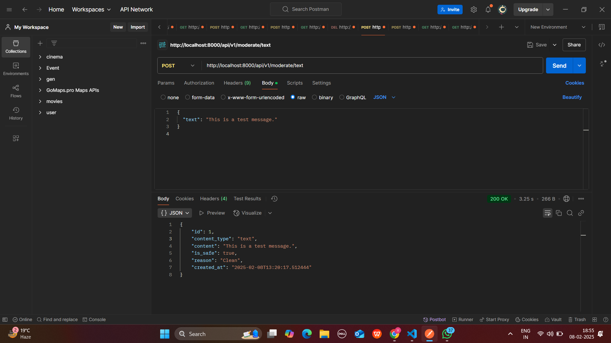
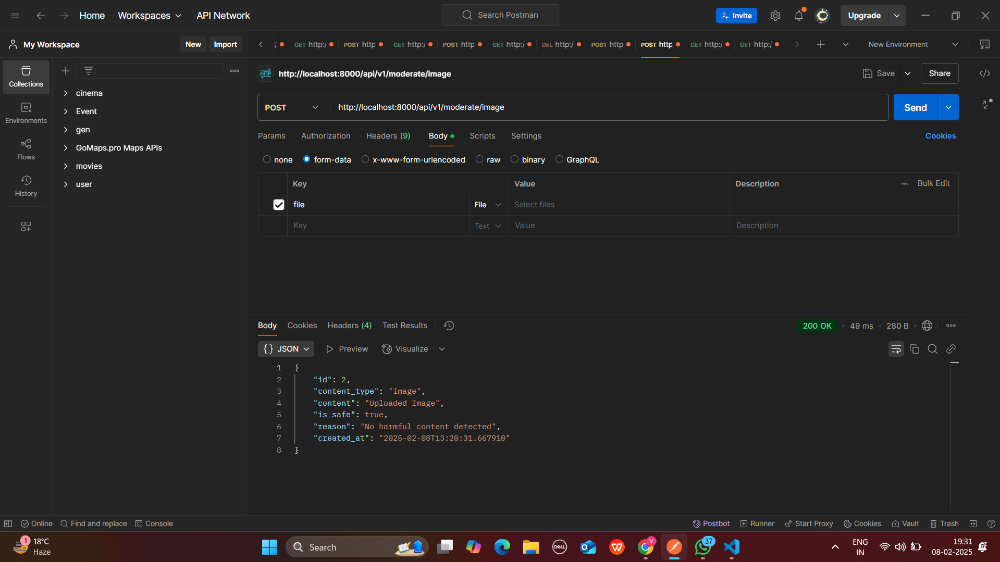
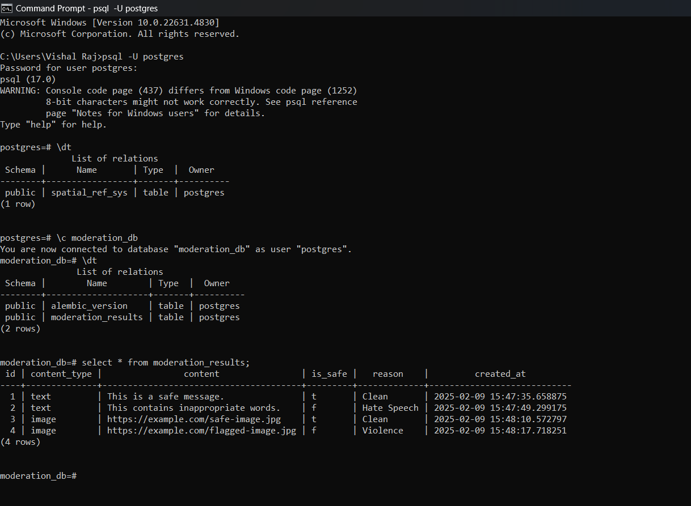
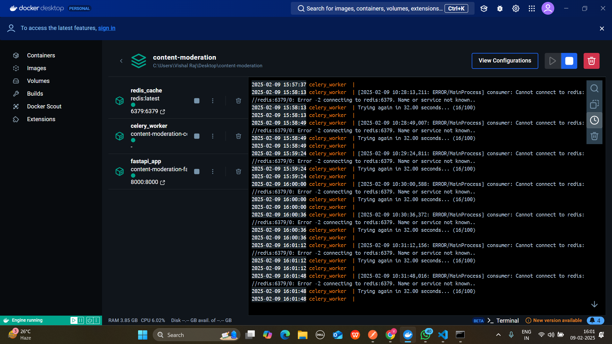

# 🚀 Scalable Content Moderation System

A scalable content moderation system that processes text and image content using AI services. The system is designed to handle high throughput, implement caching, and follow a microservices architecture.


---

## 📌 **Core Features**

### 📝 Content Processing Service

- **API for Text Moderation:**

  - Accepts text content for moderation.
  - Implements rate limiting.
  - Handles concurrent requests efficiently.
  - Uses FastAPI as the main service.

- **Moderation API Integration:**

  - Integrates with OpenAI’s moderation API.
  - Optional mock server to mimic OpenAI’s API.
  - Implements result caching using Redis.
  - Creates fallback mechanisms if the AI service is unavailable.

### 🔄 Queue Management

- Uses **Celery with Redis/RabbitMQ** for asynchronous task processing.
- **Bonus Features:**
  - Implements dead letter queues for failed jobs.
  - Adds a retry mechanism with exponential backoff.

### 🗃️ Data Management

- Stores moderation results in **PostgreSQL**.
- Implements **database migrations**.
- Creates **efficient indexing strategies**.
- Handles **concurrent database operations**.

### 📊 Monitoring & Logging

- Implements **structured logging**.
- Adds **basic metric collection** (e.g., using the Prometheus Client).
- Creates **health checkpoints**.

---

## 📡 **API Endpoints**

| Method   | Endpoint                  | Description                      |
| -------- | ------------------------- | -------------------------------- |
| **POST** | `/api/v1/moderate/text`   | Moderate text content            |
| **POST** | `/api/v1/moderate/image`  | Moderate image content           |
| **GET**  | `/api/v1/moderation/{id}` | Retrieve moderation result by ID |
| **GET**  | `/api/v1/stats`           | Get moderation statistics        |

---

## 🏗 **System Architecture**

- Uses **Docker** and `docker-compose` for containerization.
- Implements **service health checks**.
- Follows a **repository pattern** for clean code structure.

### 📌 Required Technologies

✅ FastAPI\
✅ Celery\
✅ Redis\
✅ PostgreSQL\
✅ Docker\
✅ Pydantic for validation\
✅ pytest for testing

---

## 🚀 **Getting Started**

### **🔹 Clone the Repository**

```bash
git clone https://github.com/your-repo/content-moderation.git
cd content-moderation
```

### **🔹 Install Dependencies**

```bash
pip install -r requirements.txt
```

### **🔹 Run Docker Containers**

```bash
docker-compose up -d
```

### **🔹 Run Migrations**

```bash
alembic upgrade head
```

### **🔹 Start the FastAPI Server**

```bash
uvicorn app.main:app --reload
```

### **🔹 Start Celery Worker**

```bash
celery -A app.workers.celery_worker worker --loglevel=info
```

---


### ✨ **Contributions & Feedback**

Feel free to contribute, suggest improvements, or report issues! 😊\
📩 **Contact:** [vishalrajmehra95@gmail.com](mailto\:your-email@example.com)\
💻 **GitHub:** [GitHub Repo](https://github.com/vishalraj9102/content-moderation.git)

# 🚀 Content Moderation System  Output


## 📸 Output Screenshots  
### ✅ API Response  
 



### ✅ Moderation Result  





